<div align="center">
  
# 🌟 Infinity Club Site

[](https://opensource.org/licenses/MIT)
[](https://www.typescriptlang.org/)
[](https://nextjs.org/)
[](https://reactjs.org/)
[](https://tailwindcss.com/)

### 🚀 A Modern Web Platform for the Infinity Club Community

[Live Demo](https://infinity-club-bba.vercel.app) • [Documentation](docs/) • [Report Bug](issues/) • [Request Feature](issues/)


</div>

## ✨ Features

<table>
  <tr>
    <td width="50%">
      <h3>🎨 Responsive Design</h3>
      <ul>
        <li>Fluid layouts that adapt to any screen size</li>
        <li>Mobile-first approach for optimal performance</li>
        <li>Seamless experience across all devices</li>
      </ul>
    </td>
    <td width="50%">
      <h3>📅 Event Management</h3>
      <ul>
        <li>Interactive event calendar</li>
        <li>Real-time updates and notifications</li>
        <li>Easy RSVP system</li>
      </ul>
    </td>
  </tr>
  <tr>
    <td width="50%">
      <h3>👥 Member Profiles</h3>
      <ul>
        <li>Customizable member portfolios</li>
        <li>Achievement tracking</li>
        <li>Social connection features</li>
      </ul>
    </td>
    <td width="50%">
      <h3>📝 Blog Platform</h3>
      <ul>
        <li>Rich text editor with markdown support</li>
        <li>Categories and tags</li>
        <li>Comment system</li>
      </ul>
    </td>
  </tr>
</table>

## 🛠️ Tech Stack

Our platform is built with modern technologies for optimal performance and developer experience:

```mermaid
graph LR
    A[TypeScript] --> B[Next.js]
    B --> C[React]
    C --> D[Tailwind CSS]
    D --> E[Framer Motion]
    E --> F[Radix UI]
    F --> G[Zod]
    style A fill:#007ACC
    style B fill:#000000
    style C fill:#61DAFB
    style D fill:#38B2AC
    style E fill:#FF4F8B
    style F fill:#6E56CF
    style G fill:#3068B7
```



## 🚀 Getting Started

### Prerequisites

- Node.js 18.x or later
- npm or yarn
- Git

### Installation

1. Clone the repository
```bash
git clone https://github.com/hamawebdev/infinity-club-site.git
cd infinity-club-site
```

2. Install dependencies
```bash
npm install
# or
yarn install
```

3. Start the development server
```bash
npm run dev
# or
yarn dev
```

## 📖 Usage

<table>
  <tr>
    <th>Command</th>
    <th>Description</th>
  </tr>
  <tr>
    <td><code>npm run dev</code></td>
    <td>Start development server</td>
  </tr>
  <tr>
    <td><code>npm run build</code></td>
    <td>Build for production</td>
  </tr>
  <tr>
    <td><code>npm start</code></td>
    <td>Start production server</td>
  </tr>
  <tr>
    <td><code>npm run lint</code></td>
    <td>Run ESLint</td>
  </tr>
</table>

## 🤝 Contributing

We love your input! We want to make contributing to Infinity Club Site as easy and transparent as possible. Please see our [Contributing Guide](CONTRIBUTING.md) for details.

1. Fork the Project
2. Create your Feature Branch (`git checkout -b feature/AmazingFeature`)
3. Commit your Changes (`git commit -m 'Add some AmazingFeature'`)
4. Push to the Branch (`git push origin feature/AmazingFeature`)
5. Open a Pull Request

## 📄 License

Distributed under the MIT License. See [`LICENSE`](LICENSE) for more information.

## 📬 Contact

Hama Web Dev - [@hamawebdev](https://twitter.com/hamawebdev) - hamawebdev@gmail.com

Project Link: [https://github.com/hamawebdev/infinity-club-site](https://github.com/hamawebdev/infinity-club-site)

---

<div align="center">

### ⭐ Star us on GitHub — it helps!

[infinity-club.com](https://infinity-club.com) • [@infinityclub](https://twitter.com/infinityclub)

</div>
